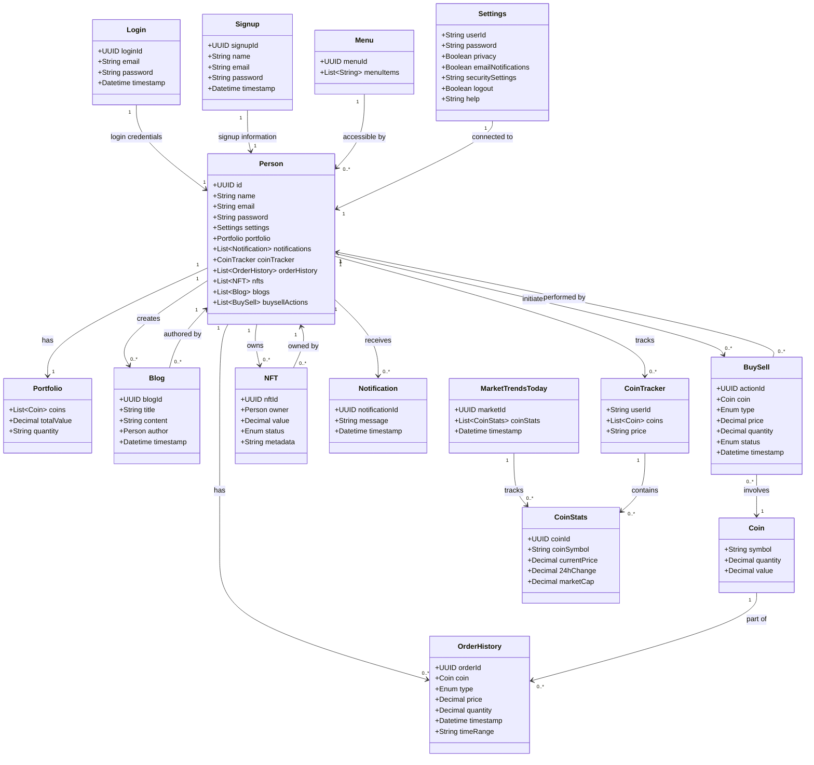

# **EquiEx - Trade Crypto, Explore NFTs, Grow Portfolio**

## **Project Overview**

EquiEx is a Progressive Web Application (PWA) designed to provide a seamless, feature-rich platform for cryptocurrency trading, NFT exploration, and portfolio management. This project integrates modern web technologies, robust backend support, and advanced capabilities to offer users an engaging and professional experience.

The application includes essential functionalities like market trend tracking, trading with real-time price updates, NFT management, and user rewards. With features like internationalization, Redux state management, and integration with Fugu capabilities, EquiEx is a comprehensive solution for digital asset enthusiasts.

---

## **Features and Functionality**

### **1. Header**
- **Before Login:**
  - **Logo Branding**: EquiEx logo for brand identity.
  - Navigation Options: `Markets`, `Trends`, `NFT Gallery`, `Academy`, `Rewards`, `Settings`, `Login`, and `Signup`.
- **After Login:**
  - `Language Change Icon`: Supports English and Hindi (Internationalization).
  - `Settings Button`: Manage account preferences and security.
  - `Logout Button`: Securely end the session.

---

### **2. Login Page**
- **Features:**
  - Email and Password validation from the backend using MongoDB.
  - **Reset Password Link**: Allows users to recover their accounts.
- **Technologies Used:**
  - Backend: Express.js, Node.js, MongoDB.

---

### **3. Signup Page**
- **Features:**
  - Fields for Username, Password, and Email.
  - **Virtual Keyboard API**: Enhances usability and satisfies Fugu capabilities.
  - `Already Have an Account? Login` link for easy navigation to the login page.
- **Functionality:**
  - User data is stored securely in the backend.

---

### **4. Hero Section**
- **Before Login:**
  - A heading, an image, and a textarea to enter an email address.
  - **Signup Button**: Navigates users to the signup page.
- **After Login:**
  - **Referral Section**:
    - Displays a referral link for user engagement.
    - Includes `My Portfolio` and `Coin Tracker` buttons for quick navigation.

---

### **5. Market Trends Today**
- **Features:**
  - Displays the top 6 coins filtered by market cap using the **CoinGecko API**.
  - Includes a `See More` button that navigates users to the `Markets` page.

---

### **6. NFT Section**
- **Features:**
  - Retrieves and displays the top 4 NFTs using the **CoinGecko API**.
  - Includes a `Visit Gallery` button to navigate to the `NFT` page.

---

### **7. Explore EquiEx More**
- **Content:**
  - Descriptions of key features: Trade, Educational Blogs, Earn Rewards, and NFT Marketplace.

---

### **8. Why EquiEx?**
- **Highlights:**
  - Secure Platform.
  - Easy-to-Use Interface.
  - Educational Resources.

---

### **9. FAQ Section**
- Common user queries and answers.

---

### **10. Footer**
- Provides navigation and contact details.

---

## **Detailed Pages**

### **Markets Page**
- **Tabs**:
  - **List View**: Displays detailed coin information including:
    - Coin Image, Name, 24-hour Price Change, Current Price, 24-hour Volume, and Total Market Cap.
    - A `Star Icon` to add coins to the `Coin Tracker` page (watchlist).
  - **Grid View**:
    - Displays coins in a grid format.
    - **Dynamic Colors**: Green for positive price changes and Red for negative changes.
- **Additional Features**:
  - Search Component for easy filtering.
  - Pagination for better navigation.

---

### **Trade Page**
- **Features**:
  - **Ticker**: Default set to Bitcoin.
  - **Chart**: Includes time period options (7 days, 30 days, 60 days, 180 days, 1 year).
  - **Buy/Sell Section**:
    - Trading balance fetched from the backend.
    - Allows users to enter amounts in USD for transactions.
    - Deducts the amount from the trading balance upon a successful transaction.
    - Adds transactions to the `Order History`, which can be downloaded as a file.
- **Navigation**:
  - Includes a `Portfolio` button that redirects users to the `Portfolio` page.

---

### **Portfolio Page**
- **Tabs**:
  - **Trading Account**:
    - Connects to the **MetaMask Wallet**.
    - Fetches wallet balance and integrates with the Sepolia blockchain for deposits and withdrawals.
    - Deposited funds are converted to USD and added to the trading balance.
    - Features real-time notifications via **Toast Messages** and **Browser Notifications API** (Fugu capability).
  - **Spot Account**:
    - Displays user assets in a table format.
    - Includes a graphical representation of asset value.

---

### **Rewards Section**
- **Features**:
  - User engagement through a 6-day streak collection system.
  - Collected coins can be used for purchasing assets in the future.

---

### **Settings Page**
- **Options**:
  - Profile Management.
  - Security Settings: Data sharing preferences and reset password functionality.
  - Notifications Settings.
  - KYC Submission: Implements **File Share API** (Fugu capability).
  - About and Contact Us Information.
  - Logout Button.

---

### **CRUD Operations**
- **NFT Section**: Allows users to create, read, update, and delete NFTs.
- **Blogs Section**: Implements CRUD operations for blogs management.

---

## **Technical Specifications**

### **Frontend**
- **Technologies Used**: React, TypeScript, CSS, Redux.
- **Key Features**:
  - Modular and reusable components.
  - Internationalization in English and Hindi.
  - PWA for installable web app and offline access.
  - Code Quality: Clean, well-documented code with comments and best practices.

### **Backend**
- **Technologies Used**: Node.js, Express.js, MongoDB.
- **Design Principles**:
  - RESTful API with Domain-Driven Design (DDD).
  - Secure and scalable architecture.
  - Documentation: Comprehensive code and API documentation for scalability.

### **Folder Organization**
- Small, focused components for better reusability.
- Separate files for services, models, and utilities.

---

### **Advanced Capabilities**
- **PWA**: 
- Offline access and installable as a web app.
- Offline functionality for seamless user experience.
- Responsive design with fast loading and smooth navigation.
- Installable on devices for native app-like behavior.

### **Fugu Capabilities**
- **File Share API**: Share KYC documents effortlessly.
- **Clipboard API**: Simplifies referral sharing in the Hero Section.
- **Browser Notifications API**: Real-time alerts for transactions and milestones.
- **Virtual Keyboard API**: Secure and user-friendly sign-up process.
---

## **How to Run**

1. Clone the repository:
   ```bash
   git clone https://github.com/info-6150-fall-2024/final-project-random
2. Install the required dependencies:
    ```bash
    npm create vite@latest app -- --template
    cd app
    npm i
    add port number in vite.config.js
    npm install @mui/material @emotion/react @emotion/styled
    npm install axios
    npm install bootstrap axios react-router-dom
    npm install react-virtual-keyboard
    npm install @reduxjs/toolkit react-redux
    npm install i18next react-i18next
    npm install ethers
    npm i -s i18next react-i18next i18next-http-backend
    npm install -D @vite-pwa/assets-generator
    npm install -D vite-plugin-pwa
    npm i @vite-pwa/assets-generator -D 

## Team Members

- **Bhavya Likhitha Bukka**: bukka.b@northeastern.edu
- **Akshay Raj Chevala**: chevala.a@northeastern.edu
- **Sneh Patil**: patil.sneh1@northeastern.edu
- **Ayush Ovhal**: ovhal.a@northeastern.edu

## Object Model

Below is the **Domain Driven Design** (DDD) model represented using **Mermaid** for visualizing the entities, value objects, relationships, and cardinality within the EquiEx platform.


