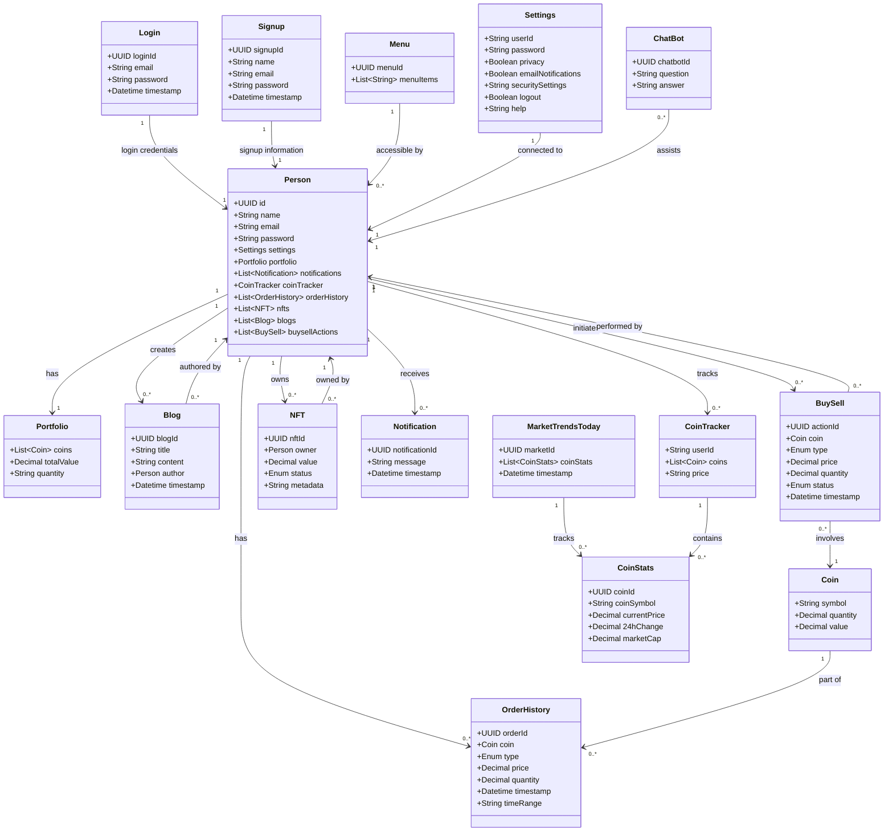

# EquiEx - Trade Crypto, Explore NFTs, Grow Portfolio

## Project Overview

EquiEx is an innovative platform designed to provide users with an all-in-one solution for trading cryptocurrency, exploring NFTs, and managing their portfolios. The application is user-friendly and integrates multiple features for an enhanced experience in the world of digital assets. EquiEx allows users to track market trends, buy and sell cryptocurrencies, maintain a portfolio, explore NFTs, and stay informed with the latest updates through notifications and blogs.

## Features

### 1. **Landing Page**

- **Logo**: The EquiEx branding.
- **Settings**: A personalized user profile section.
- **Buy and Sell**: Quick access to crypto trading options.
- **Blogs**: Read, add, and delete blogs related to the crypto world.
- **Notifications**: Receive real-time notifications on price changes, rewards, and milestones.
- **NFT Gallery**: View and manage your NFTs.
- **Login/Signup**: Secure user authentication.
- **Rewards**: User can earn rewards by collecting daily coins
- **Menu**: Easy navigation to all features.

### 2. **Hero Section**

- A referal link to share and copy to clipboard options  satisfying **fugu capability**
- A visually appealing section with an image and buttons like **My Portfolio** and **Coin Tracker**.

### 3. **Market Trends Today**

- Integration with the **CoinGecko API** to display live market trends.
- List, Grid, search and pagination compoenents for better ui experience

### 4. **Buy and Sell Page**

- **Live Trading View** chart for real-time market data.
- Buy/Sell options with **Market**, and **Global USDT** settings.
- Added transactions are stored in **Order History**, with an option to download.

### 5. **Portfolio Page**

- Displays the total coin value, quantity, and portfolio worth.

### 6. **Blogs Page**

- List of blogs with an option to add, delete, or read them.
- A community sign-up form for users to engage with the content.

### 7. **Coin Tracker Page**

- Users can add and delete their favorite coins and monitor quantities.

### 8. **Settings Page**

- Account management options, including user ID, password, privacy settings, and support.

### 9. **NFT Gallery**

- Users can add, list, delete, and update NFTs along with their values.

### 10. **Notifications**

- Automated notifications on each task performed like buy, sell, deposit and widthdrawn, milestones, and rewards like diamonds.

## Team Members

- **Bhavya Likhitha Bukka**: bukka.b@northeastern.edu
- **Akshay Raj Chevala**: chevala.a@northeastern.edu
- **Sneh Patil**: patil.sneh1@northeastern.edu
- **Ayush Ovhal**: ovhal.a@northeastern.edu

## Object Model

Below is the **Domain Driven Design** (DDD) model represented using **Mermaid** for visualizing the entities, value objects, relationships, and cardinality within the EquiEx platform.

